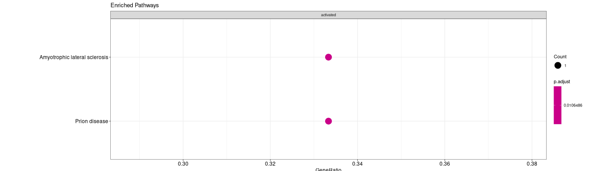

# Introduction

The functional network explorer takes as input a genetic network; in this example the network is constructed using the  NETBid algorithm on RNA-seq data from breast cancer tumors from The Cancer Genome Atlas. The network connections represent transcription factor and signalling factor activity between genes.

The data are visuallized with the OpenOrd (also called DRL) algorithms to layout the network with interrelated genes near each other. HDBSCAN can be used to cluster the layout, and the transcription factor and signalling factor activity can be visualized in a collor coded graph layout, or in a beeswarm plot.  If there are enough genes in the cluster, enriched pathways can be assessed. 

# Guide

## Controls:
Here are the controls:

## Layout
Click 'Run Network Layout' to run the OpenOrd algorithm and plot the nodes of the network.  Hover over network nodes to display the genes they represend in a table. Drag on the top left plot to zoom in on the right plot.

## Cluster
The network layout can be clustered using HDBSCAN. Adjust 'N for hdbscan' to change the minimum cluster size. Check 'Force Hard Cluster' to use K-nearest-neighbors to force left-over noise points from HDBSCAN to be assigned to a cluster.

## Visualize Activity
The bottom two plots can be used to visualize activity of different genes. Select 'numerator' and 'denominator' to select different tissue types. Differential activity is displayed in log-ratio.  The bottom-left plot mirrors the top two plotsj, and the bottom right one allows easier inspection of the differential activity for each cluster.

Can adjust the color scale to see different gradations in activity.

## Pathway Enrichment (In progress)
Select a cluster to run enrichment analysis on fith 'cluster for GSEA'. Click 'Run GSEA'. Active pathway are displayed on a chart in the bottom. 

